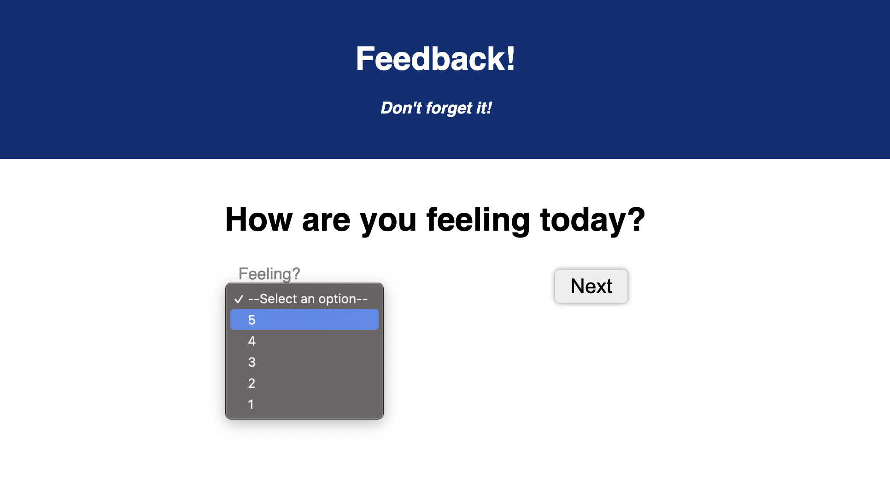
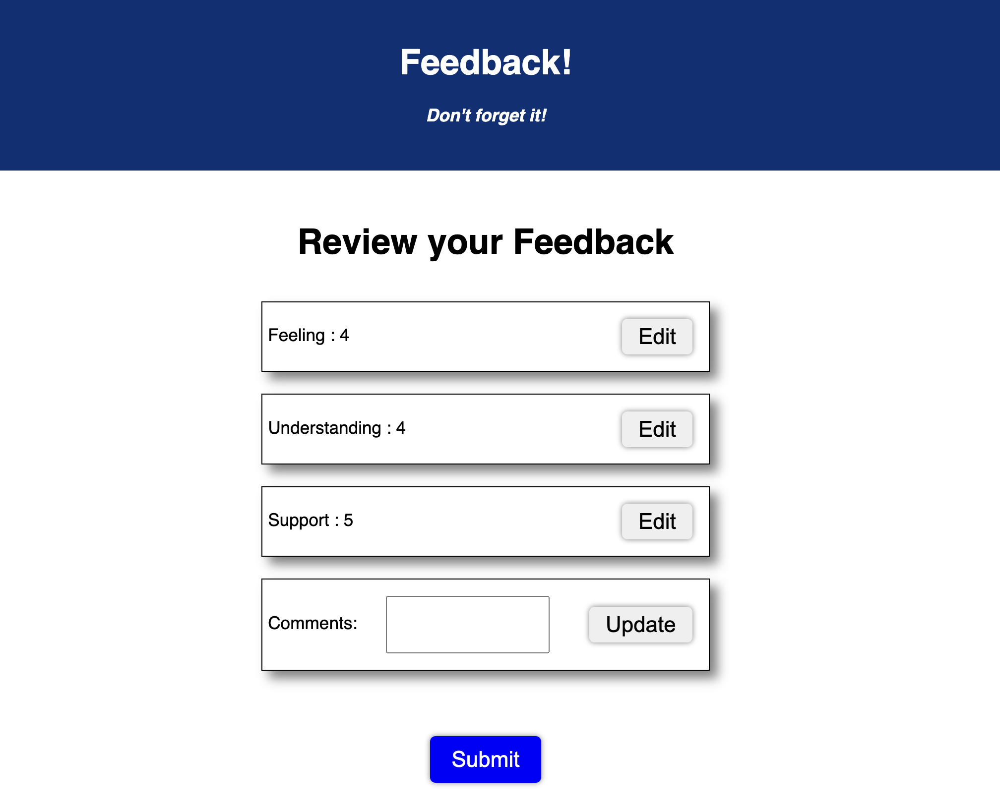

# Feedback Survey - React and Redux Full Stack

Duration: Weekend Project

## Description

For this assignment, I built a Feedback survey program that utilized multiple components of React and Redux.

The program steps you through each question, navigating to a new page when the next button is clicked. This process utilizes React routers and page links to navigate through the survey without clearning the Redux store state. Once all of the questions are answered, you are brought to a review page, where you are able to ensure your answers are as you want them to be or update them if you have changed your mind.

The whole project is componetized and reused where able. Each question page is the same component with different information sent to it via props. The question component looks like this:

Additionally, every line of the review page is a singular component, sent different information and rendered condtionally depending upon the inputs and the local state of the edit button. The visual is shown below:

I chose to do this because I wanted to maximize my code and ensure that I was utilizing the full strength of React by componetizing my project where I could.

## Built With

The languages that made up the tech stack for this project was:

- HTML
- CSS
- JAVASCRIPT
- REACT
- REDUX
- Node.js
- PostgreSQL
- pg
- express
- axios

## Installation

To get this project up and running:

1. Create a database based on the specification in the data.sql file included in the project. The names and queries there should be set up to create the backend database.
2. Run `npm install` to install all of the dependencies, including the proper versions of react and redux.
3. Run `npm run server` in your terminal.
4. Run `npm run client` in your terminal. This should open a new web browser tab for you.
5. Enjoy! :)

## Acknowledgement

I would like to thank [Prime Digital Academy](primeacademy.io) who equipted me to handle the creation of this application. I would also like to thank my partner, and his unending support throughout this process.
